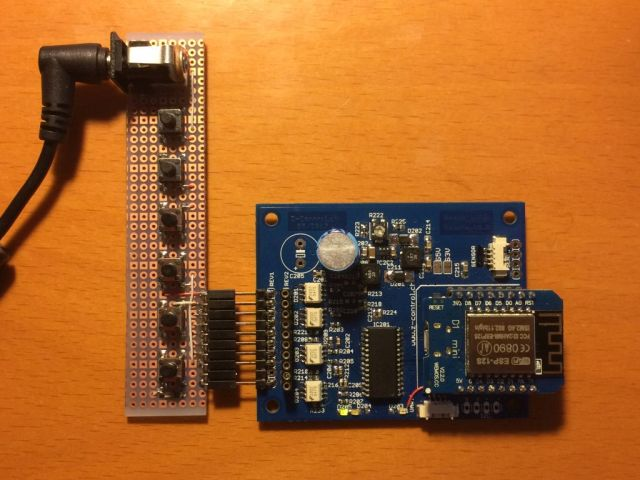
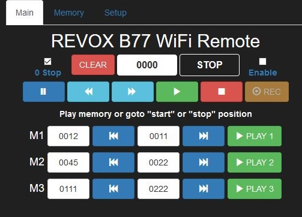

## Purpose

This project aims to control a REVOX B77 Tape recoder from the 70ies over the internet.
The functionnality will include a copy of the remote switches to be included on a WEB page on a connected device such as PC or smartphone. The interface is made on HTML allowing all web connected devices to control the tape recorder.

The tape position will be recored using 2 hall sensors detecting the main (right) reel. The digital front display may also be used as counter with the same hall detectors. An UART interface between counter and remote controller (ESP8266) is planned.

The hardware interface (PCB see zcontrol.ch) will be plugged in on the Tape controller. The original hardware of the tape recorder remains unchanged.

The hardware is based on a ESP8266 Wemos D1, an MCP23017 i2c/parallel interface, 4 dual opto-couplers and a switched power supply generating 5V out of the 24V Tape recorder's interface.

An optional digital display will also be available to replace the mechanical counter on the recorders front pannel.
This display will be similar to arduino mini (layout) including 4 7-segment led display and his own switched power supply.

PROJECT is under developpment !!! June-July 2017

## Code Example

The code on Git is not yet fully functionnal. It has been uploaded for backup purpose only
.Libraries uploaded are Adafruit MCP23017 and Arduino WebSockets used in the project.
!! remote control does not work with the current code !!!

## Installation

Developpment hardware with test connection and switches.

## API, web interface

The web interface is bootstrap based, will be reviewed for the final version

## Contributors

Contact rolfz(at)z-control.ch for any questions regarding this code

## License

MIT Licence.
